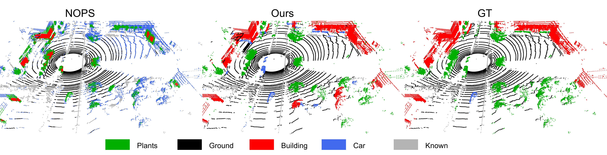

# The official code for "Dual-level Adaptive Self-Labeling for Novel Class Discovery in Point Cloud Segmentation (ECCV2024)"
> Paper link: [Arxiv](https://arxiv.org/abs/2407.12489)
> 
> Dual-level Adaptive Self-Labeling for Novel Class Discovery in Point Cloud Segmentation
> 
> Ruijie Xu*, Chuyu Zhang*, Hui Ren, Xuming He
> 
> (The first two authors contribute equally).

>Abstract: We tackle the novel class discovery in point cloud segmentation, which discovers novel classes based on the semantic knowledge of seen classes. Existing work proposes an online point-wise clustering method with a simplified equal class-size constraint on the novel classes to avoid degenerate solutions. However, the inherent imbalanced distribution of novel classes in point clouds typically violates the equal class-size constraint. Moreover, point-wise clustering ignores the rich spatial context information of objects, which results in less expressive representation for semantic segmentation. To address the above challenges, we propose a novel self-labeling strategy that adaptively generates high-quality pseudo-labels for imbalanced classes during model training. In addition, we develop a dual-level representation that incorporates regional consistency into the point-level classifier learning, reducing noise in generated segmentation. Finally, we conduct extensive experiments on two widely used datasets, SemanticKITTI and SemanticPOSS, and the results show our method outperforms the state of the art by a large margin.
>
<!-- <style>
figure {
  text-align: center;
}

figcaption {
  display: block;
  margin: 0 auto;
}
</style> -->

<br>
<p align="center">
     <br />
    <em>
     An overview of our framework.
    </em>
</p>

<p align="center">
     <br />
    <em>
     Visual comparisons between NOPS and our method.
    </em>
</p>
<br>

## Installation

Please refer to the environment of the code in [NOPS](https://github.com/LuigiRiz/NOPS/tree/main).

## Data preparation

Please follow the instructions from SemanticKITTI and SemanticPOSS to download the data. Afterward, structure the folders as shown below:

```
./
├── 
├── ...
└── path_to_data_shown_in_yaml_config/
      └── sequences
            ├── 00/           
            │   ├── velodyne/	
            |   |	   ├── 000000.bin
            |   |	   ├── 000001.bin
            |   |	   └── ...
            │   └── labels/ 
            |          ├── 000000.label
            |          ├── 000001.label
            |          └── ...
            └── ...
```

## Commands


### Train

```
python train.py -s [SPLIT NUMBER] --dataset SemanticPOSS --offline --comment [CHECKPOINT NAME] --epoch 10 --use_scheduler --lam 1 --lam_region 1 --gamma 1 --alpha 1 --gamma_decrease 0.5 --smooth_bound 10 --ak_bound 0.005 --dbscan 0.5
```
```
python train.py -s [SPLIT NUMBER] --dataset SemanticKITTI --offline --comment [CHECKPOINT NAME] --epoch 10 --use_scheduler --lam 1 --lam_region 1 --gamma 1 --alpha 1 --gamma_decrease 0.5 --smooth_bound 10 --ak_bound 0.005 --dbscan 0.5
```
## Citation


If you find our work is useful, please cite our paper:

```
@article{xu2024dual,
  title={Dual-level Adaptive Self-Labeling for Novel Class Discovery in Point Cloud Segmentation},
  author={Xu, Ruijie and Zhang, Chuyu and Ren, Hui and He, Xuming},
  journal={arXiv preprint arXiv:2407.12489},
  year={2024}
}
```


And you can also check other work in our group.

```
@article{zhang2023novel,
  title={Novel Class Discovery for Long-tailed Recognition},
  author={Zhang, Chuyu and Xu, Ruijie and He, Xuming},
  journal={Transactions on Machine Learning Research},
  year={2023}
}
```

```
@InProceedings{Gu_2023_ICCV,
    author    = {Gu, Peiyan and Zhang, Chuyu and Xu, Ruijie and He, Xuming},
    title     = {Class-relation Knowledge Distillation for Novel Class Discovery},
    booktitle = {Proceedings of the IEEE/CVF International Conference on Computer Vision (ICCV)},
    month     = {October},
    year      = {2023},
    pages     = {16474-16483}
}
```


## Todo

We will soon upload instructions on how to use DBSCAN to generate regions and checkpoints.

