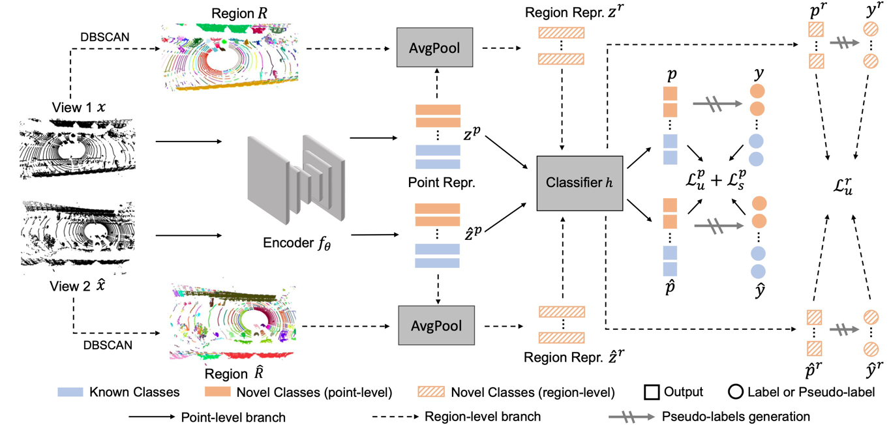

# The official code for "Dual-level Adaptive Self-Labeling for Novel Class Discovery in Point Cloud Segmentation (ECCV2024)"
> Paper link: [Arxiv](https://arxiv.org/abs/2407.12489)
> 
> Dual-level Adaptive Self-Labeling for Novel Class Discovery in Point Cloud Segmentation
> 
> Ruijie Xu*, Chuyu Zhang*, Hui Ren, Xuming He
> 
> (The first two authors contribute equally).

>Abstract: We tackle the novel class discovery in point cloud segmentation, which discovers novel classes based on the semantic knowledge of seen classes. Existing work proposes an online point-wise clustering method with a simplified equal class-size constraint on the novel classes to avoid degenerate solutions. However, the inherent imbalanced distribution of novel classes in point clouds typically violates the equal class-size constraint. Moreover, point-wise clustering ignores the rich spatial context information of objects, which results in less expressive representation for semantic segmentation. To address the above challenges, we propose a novel self-labeling strategy that adaptively generates high-quality pseudo-labels for imbalanced classes during model training. In addition, we develop a dual-level representation that incorporates regional consistency into the point-level classifier learning, reducing noise in generated segmentation. Finally, we conduct extensive experiments on two widely used datasets, SemanticKITTI and SemanticPOSS, and the results show our method outperforms the state of the art by a large margin.
>
<!--  -->

 

      
    <em>
     An overview of our framework.
    </em>

 

 

